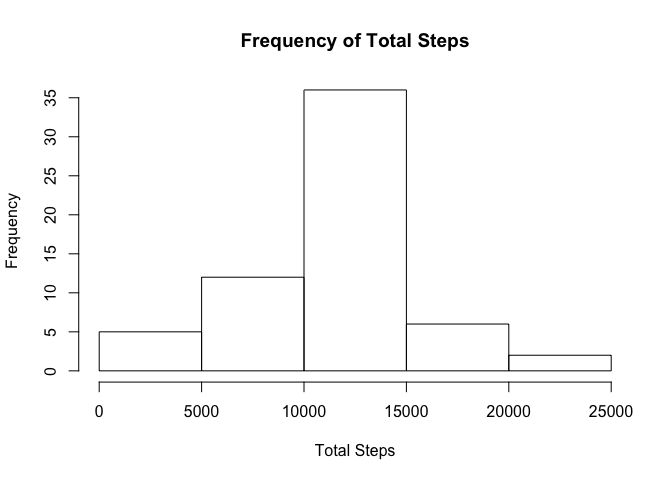

## Loading and preprocessing the data

First load some of the libraries that will be utilized later on (dplyr and lattice).


```r
library(dplyr)
```

```
## 
## Attaching package: 'dplyr'
```

```
## The following objects are masked from 'package:stats':
## 
##     filter, lag
```

```
## The following objects are masked from 'package:base':
## 
##     intersect, setdiff, setequal, union
```

```r
library(lattice)
```

The data for this assignment can be downloaded from https://d396qusza40orc.cloudfront.net/repdata%2Fdata%2Factivity.zip

We will download the data from this location, unzip, and read it into raw table activityData.  Then we will get a summary of its contents to make sure it lines up with the description of the file.  


```r
download.file("https://d396qusza40orc.cloudfront.net/repdata%2Fdata%2Factivity.zip", "activity.zip")
activityData <- read.csv(unzip("activity.zip"))
str(activityData)
```

```
## 'data.frame':	17568 obs. of  3 variables:
##  $ steps   : int  NA NA NA NA NA NA NA NA NA NA ...
##  $ date    : Factor w/ 61 levels "2012-10-01","2012-10-02",..: 1 1 1 1 1 1 1 1 1 1 ...
##  $ interval: int  0 5 10 15 20 25 30 35 40 45 ...
```

We see that the number of observations matches the expected value of 17568, and we see the expected columns of steps, date, and interval. However, the date is a factor, and we will need it in the a date format, so we will go ahead and convert the column to a date.


```r
activityData$date <- as.Date(activityData$date)
str(activityData)
```

```
## 'data.frame':	17568 obs. of  3 variables:
##  $ steps   : int  NA NA NA NA NA NA NA NA NA NA ...
##  $ date    : Date, format: "2012-10-01" "2012-10-01" ...
##  $ interval: int  0 5 10 15 20 25 30 35 40 45 ...
```


We will also create a table activityDataStepsNotNA which contains all observations for which steps has a recorded value (i.e. not NA).


```r
activityDataStepsNotNA <- activityData[!is.na(activityData$steps),]
str(activityDataStepsNotNA)
```

```
## 'data.frame':	15264 obs. of  3 variables:
##  $ steps   : int  0 0 0 0 0 0 0 0 0 0 ...
##  $ date    : Date, format: "2012-10-02" "2012-10-02" ...
##  $ interval: int  0 5 10 15 20 25 30 35 40 45 ...
```

After removing the data points that have NA steps, we are left with 15264 observations.

## What is mean total number of steps taken per day?

We will create an aggregate stepsByDate from activityDataStepsNotNA.  This aggregate will have total steps by each date.


```r
stepsByDate<- aggregate (activityDataStepsNotNA$steps, 
                         by=list(Date=activityDataStepsNotNA$date), FUN=sum)
colnames(stepsByDate) <- c("date", "steps")
```


We will now create a histogram of frequency of total steps in a day.


```r
hist(stepsByDate$steps, main="Frequency of Total Steps", xlab="Total Steps")
```

<!-- -->


Now let's find the mean total number of steps in a day and the median.

```r
mean(stepsByDate$steps, na.rm=TRUE)
```

```
## [1] 10766.19
```

```r
summary(stepsByDate$steps)
```

```
##    Min. 1st Qu.  Median    Mean 3rd Qu.    Max. 
##      41    8841   10765   10766   13294   21194
```

The mean 10766 steps, and the median is 10765 steps.

## What is the average daily activity pattern?

We will create an aggregate stepsByInterval from activityDataStepsNotNA.  This aggregate will have average steps per interval.


```r
stepsByInterval<- aggregate (activityDataStepsNotNA$steps, 
                             by=list(Date=activityDataStepsNotNA$interval), FUN=mean)
colnames(stepsByInterval) <- c("interval", "steps")
```

Let's plot the average steps by time interval.


```r
plot(stepsByInterval$interval, stepsByInterval$steps, type="l", 
     xlab="Time Interval", ylab="Average Steps", main="Average Steps by Time Interval")
```

<!-- -->

Let's determine which interval has the highest number of steps.


```r
stepsByInterval[order(-stepsByInterval$steps),][1,]
```

```
##     interval    steps
## 104      835 206.1698
```

Interval 835 has the highest mean number of steps, 206.

## Imputing missing values
To impute the values, we are going to use the average steps by interval.
First we are going to round the average steps by interval to nearest whole number since steps should be a whole number


```r
roundedStepsByInterval <- stepsByInterval
roundedStepsByInterval$steps <- round(roundedStepsByInterval$steps)
```

Now we are going to create a new table, imputedActivityData, which fills in NA values with the average steps for the interval.  First we will merge the raw data (activityData) with the average steps per interval, rounded (roundedStepsByInterval).  We will verify that the merged data has 17568 observations, matching the raw data, and that there are NA values in the steps.x column, which contains activityData$steps. 


```r
imputedActivityData <- merge(x=activityData, y=roundedStepsByInterval, by="interval")
str(imputedActivityData)
```

```
## 'data.frame':	17568 obs. of  4 variables:
##  $ interval: int  0 0 0 0 0 0 0 0 0 0 ...
##  $ steps.x : int  NA 0 0 0 0 0 0 0 0 0 ...
##  $ date    : Date, format: "2012-10-01" "2012-11-23" ...
##  $ steps.y : num  2 2 2 2 2 2 2 2 2 2 ...
```

```r
head(imputedActivityData)
```

```
##   interval steps.x       date steps.y
## 1        0      NA 2012-10-01       2
## 2        0       0 2012-11-23       2
## 3        0       0 2012-10-28       2
## 4        0       0 2012-11-06       2
## 5        0       0 2012-11-24       2
## 6        0       0 2012-11-15       2
```

Now we will create a column newSteps in imputedActivityData, which will consist of the steps from the raw data with NA values replaced with the average steps for the interval (steps.y).  We will then view a few rows in the data to verify that newSteps equals steps.y if steps.x is NA.


```r
imputedActivityData$newSteps <- with(imputedActivityData, ifelse(is.na(steps.x), steps.y, steps.x))
head(imputedActivityData)
```

```
##   interval steps.x       date steps.y newSteps
## 1        0      NA 2012-10-01       2        2
## 2        0       0 2012-11-23       2        0
## 3        0       0 2012-10-28       2        0
## 4        0       0 2012-11-06       2        0
## 5        0       0 2012-11-24       2        0
## 6        0       0 2012-11-15       2        0
```

We now want to see if imputing data causes any significant differences in the distribution, mean, and median versus the dataset without NA observations.

First let's create an aggregate of the imputed data by date.


```r
imputedStepsByDate<- aggregate (imputedActivityData$newSteps, 
                         by=list(Date=imputedActivityData$date), FUN=sum)
colnames(imputedStepsByDate) <- c("date", "steps")
```


Let's create a histogram of the data.


```r
hist(imputedStepsByDate$steps, main="Frequency of Total Steps", xlab="Total Steps")
```

<!-- -->

The histogram with imputed data is very similar to the histogram without NA observations.

We now look at mean and median.


```r
mean(imputedStepsByDate$steps, na.rm=TRUE)
```

```
## [1] 10765.64
```

```r
summary(imputedStepsByDate$steps)
```

```
##    Min. 1st Qu.  Median    Mean 3rd Qu.    Max. 
##      41    9819   10762   10766   12811   21194
```

Mean without NA obervations: 10766

Mean with Imputed data: 10766

Median without NA observations: 10765

Median with Imputed data: 10762

The mean and median are not significantly different once we impute the data.

## Are there differences in activity patterns between weekdays and weekends?

First we add a dayType factor variable to the imputed data.  dayType has 2 levels, weekday and weekend, depending on the day of the week for the date.  We will view some rows from the data frame to make sure the new column is properly set.


```r
imputedActivityData$dayType <- as.factor(with(imputedActivityData, 
                                    ifelse(weekdays(date) == "Saturday" | weekdays(date) == "Sunday",
                                           "weekend", "weekday")))
head(imputedActivityData, n=100L)
```

```
##     interval steps.x       date steps.y newSteps dayType
## 1          0      NA 2012-10-01       2        2 weekday
## 2          0       0 2012-11-23       2        0 weekday
## 3          0       0 2012-10-28       2        0 weekend
## 4          0       0 2012-11-06       2        0 weekday
## 5          0       0 2012-11-24       2        0 weekend
## 6          0       0 2012-11-15       2        0 weekday
## 7          0       0 2012-10-20       2        0 weekend
## 8          0       0 2012-11-16       2        0 weekday
## 9          0       0 2012-11-07       2        0 weekday
## 10         0       0 2012-11-25       2        0 weekend
## 11         0      NA 2012-11-04       2        2 weekend
## 12         0       0 2012-11-08       2        0 weekday
## 13         0       0 2012-10-12       2        0 weekday
## 14         0       0 2012-10-30       2        0 weekday
## 15         0       0 2012-11-26       2        0 weekday
## 16         0      47 2012-10-04       2       47 weekday
## 17         0       0 2012-11-27       2        0 weekday
## 18         0       0 2012-10-31       2        0 weekday
## 19         0       0 2012-11-18       2        0 weekend
## 20         0       0 2012-10-05       2        0 weekday
## 21         0       0 2012-10-14       2        0 weekend
## 22         0       0 2012-10-23       2        0 weekday
## 23         0       0 2012-11-19       2        0 weekday
## 24         0       0 2012-10-11       2        0 weekday
## 25         0       0 2012-10-15       2        0 weekday
## 26         0       0 2012-10-06       2        0 weekend
## 27         0       0 2012-11-11       2        0 weekend
## 28         0       0 2012-11-29       2        0 weekday
## 29         0       0 2012-11-02       2        0 weekday
## 30         0       0 2012-10-07       2        0 weekend
## 31         0       0 2012-11-03       2        0 weekend
## 32         0      NA 2012-11-30       2        2 weekday
## 33         0       0 2012-11-21       2        0 weekday
## 34         0       0 2012-10-02       2        0 weekday
## 35         0       0 2012-10-26       2        0 weekday
## 36         0       0 2012-11-22       2        0 weekday
## 37         0       0 2012-11-28       2        0 weekday
## 38         0       0 2012-11-13       2        0 weekday
## 39         0       0 2012-10-18       2        0 weekday
## 40         0       0 2012-10-27       2        0 weekend
## 41         0      NA 2012-11-14       2        2 weekday
## 42         0      10 2012-10-22       2       10 weekday
## 43         0      34 2012-10-10       2       34 weekday
## 44         0       0 2012-10-19       2        0 weekday
## 45         0      NA 2012-11-09       2        2 weekday
## 46         0       0 2012-10-17       2        0 weekday
## 47         0       0 2012-10-16       2        0 weekday
## 48         0       0 2012-10-29       2        0 weekday
## 49         0      NA 2012-11-01       2        2 weekday
## 50         0       0 2012-10-21       2        0 weekend
## 51         0      NA 2012-11-10       2        2 weekend
## 52         0       0 2012-10-03       2        0 weekday
## 53         0       0 2012-11-17       2        0 weekend
## 54         0       0 2012-11-12       2        0 weekday
## 55         0       0 2012-10-25       2        0 weekday
## 56         0       0 2012-10-13       2        0 weekend
## 57         0       0 2012-10-24       2        0 weekday
## 58         0      NA 2012-10-08       2        2 weekday
## 59         0       0 2012-11-20       2        0 weekday
## 60         0       0 2012-11-05       2        0 weekday
## 61         0       0 2012-10-09       2        0 weekday
## 62         5       0 2012-10-13       0        0 weekend
## 63         5      NA 2012-10-01       0        0 weekday
## 64         5       0 2012-11-18       0        0 weekend
## 65         5       0 2012-10-05       0        0 weekday
## 66         5       0 2012-11-29       0        0 weekday
## 67         5       0 2012-11-25       0        0 weekend
## 68         5      NA 2012-11-04       0        0 weekend
## 69         5       0 2012-11-02       0        0 weekday
## 70         5       0 2012-11-23       0        0 weekday
## 71         5       0 2012-11-06       0        0 weekday
## 72         5       0 2012-10-21       0        0 weekend
## 73         5       0 2012-11-21       0        0 weekday
## 74         5       0 2012-11-15       0        0 weekday
## 75         5       0 2012-11-16       0        0 weekday
## 76         5      NA 2012-11-30       0        0 weekday
## 77         5       0 2012-10-11       0        0 weekday
## 78         5       0 2012-11-13       0        0 weekday
## 79         5       0 2012-10-15       0        0 weekday
## 80         5       0 2012-11-19       0        0 weekday
## 81         5       0 2012-11-11       0        0 weekend
## 82         5      NA 2012-11-14       0        0 weekday
## 83         5       0 2012-11-26       0        0 weekday
## 84         5       0 2012-10-28       0        0 weekend
## 85         5       0 2012-11-24       0        0 weekend
## 86         5      NA 2012-11-09       0        0 weekday
## 87         5       0 2012-10-22       0        0 weekday
## 88         5       0 2012-10-16       0        0 weekday
## 89         5      NA 2012-10-08       0        0 weekday
## 90         5       0 2012-11-28       0        0 weekday
## 91         5      NA 2012-11-10       0        0 weekend
## 92         5       0 2012-10-23       0        0 weekday
## 93         5       0 2012-10-03       0        0 weekday
## 94         5       0 2012-10-27       0        0 weekend
## 95         5       0 2012-11-20       0        0 weekday
## 96         5       0 2012-10-06       0        0 weekend
## 97         5       0 2012-10-30       0        0 weekday
## 98         5       0 2012-10-31       0        0 weekday
## 99         5      18 2012-10-10       0       18 weekday
## 100        5       0 2012-11-03       0        0 weekend
```

Now we will generate the dataset fo average steps by interval and day type.


```r
stepsByIntervalAndDayType = imputedActivityData %>% group_by(interval, dayType) %>%
     summarize (avgSteps = mean(newSteps))
```

Now we can plot this data for average number of stypes by interval per day type.


```r
xyplot(avgSteps ~ interval | factor(dayType), data=stepsByIntervalAndDayType, 
       type="l", layout=c(1,2), xlab="Interval", 
       ylab = "Average Number of Steps", 
       main= "Average Number of Steps by Interval per Day Type")
```

<!-- -->

The plot shows that there is an early spike of activity on weekdays, but activity starts later in the day on weekends.
